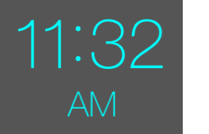

# TimeView

Cocoa Touch view that shows a time in 12-hour or 24-hour format. In 12-hour format the AM/PM text can be placed either to the right
or below the time. The time and AM/PM fonts and font sizes can be different.

The text can be aligned in one of four ways: **Left**, **Center**, **Right**, and **Fixed**. Left, Center, and Right have the most effect in 12-hour mode
when the AM/PM text is below the time, otherwise the effect is minimal. With Fixed alignment, the position of the colon, and the position of
the AM/PM text (if shown), are fixed.

For esthetic reasons, the width of the TimeView is adjusted dynamically as the time changes, so that if the background color is different from that of the enclosing view,
a constant visual inset of the time from the TimeView border is maintained. Note that this means that if the alignment is Center or Right,
in order to keep center or right alignment of the TimeView relative to its parent view, the centerX or rightX values of the TimeView need to be reset when the
time value changes. See layoutSubviews in ViewController.swift in TimeViewDemo/TestTimeViewAlignment.

The time is formatted per WWDC 2013 Session 223 — Using Fonts with Text Kit. This allows for proportional spacing of the numbers
and a time-specific colon glyph.

Example: Left, Center, Right alignment in 12-hour mode with the AM/PM text below the time

  

Example: Fixed alignment with the AM/PM text to the right of the time

TimeView is used in the video: "Time setter for touch-screen devices - Demo" [Download](https://www.dropbox.com/s/7amn3zjnpqknsci/TimeSetterDemo.mp4?dl=1) or [Vimeo](https://vimeo.com/136535301)

Usage:
    
    timeView.is24Hour       Bool               Set true for 24-hour format (no AM/PM, hours 0 to 23).
    timeView.time           NSDate             The time to display.
    timeView.timeIsValid    Bool               If false, 0:00 is displayed if the format is 12-hour
                                               (i.e. is24Hour is false)
    timeView.mainFontName   String             Font for the hour, minute, and colon.
    timeView.mainFontSize   CGFloat            Size of the main font.
    timeView.amPmFontName   String             Font for "AM" or "PM".
    timeView.amPmFontSize   CGFloat            Size of the AM/PM font.
    timeView.amPmBelow      Bool               Set true to place the AM/PM text below the hour and
                                               minute, otherwise it is placed to the right.
    timeView.alignment      TimeViewAlignment  Left, Center, Right, or Fixed. The latter means that
                                               the colon and AM/PM text will have fixed positions.
    timeView.amPmOffset     CGPoint            Offset for the AM/PM part of label. Allows for adjusting
                                               of spacing and alignment.
    timeView.textColor      UIColor            Color of the time text.

#### License

MIT - Copyright (c) 2015 Richard Clark
